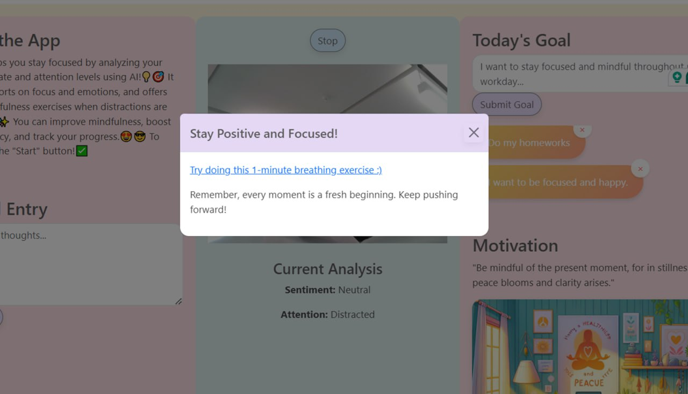

# Mindful Workday with AI

## Introduction

In today's fast-paced digital world, distractions are everywhere, making it challenging to maintain focus and mental clarity. **Mindful Workda with AI** helps users regain their concentration and track their emotional well-being throughout the day.

By leveraging state-of-the-art AI, deep learning, and computer vision, this app performs sentiment and attention analysis via webcam images. It alerts users after prolonged distraction or sadness and suggests breathing exercises for relaxation. Additionally, the app integrates **ChatGPT** to generate personalized inspirational quotes and images based on the user’s mood and journal entries.

## Key Features

- **Sentiment & Attention Analysis**: Detects emotions and focus levels using AI and computer vision.
- **Real-time Alerts**: Notifies users when distracted or sad, recommending breathing exercises.
- **Daily Reports**: Visualizes emotional trends and attention patterns.
- **Personalized Quotes**: Generates quotes and images tailored to the user’s sentiment and journals.

Mindful Workday combines these features to enhance productivity, emotional balance, and personal growth.

## Getting Started

To run Mindful Workday with AI, there are two approaches: using Docker or running the app locally with Python and the required dependencies.

### Approach 1: Using Docker

1. Clone the repository to your local machine:

   ```bash
   git clone https://github.com/your-repo/mindful_workday.git
   cd mindful_workday
   ```

2. Build the Docker image:

   ```bash
   docker build -t mindful_workday .
   ```

3. Run the application in a Docker container:

   ```bash
   docker run -d -p 5000:5000 -v $(pwd)/database.db:/app/database.db --name mindful_workday_container --rm mindful_workday
   ```

   The application will be accessible at `http://localhost:5000`.

### Approach 2: Running Without Docker

1. Clone the repository to your local machine:

   ```bash
   git clone https://github.com/your-repo/mindful_workday.git
   cd mindful_workday
   ```

2. Install the required dependencies:

   ```bash
   pip install -r requirements.txt
   ```

3. Run the application:

   ```bash
   python app.py
   ```

   The application will be accessible at `http://localhost:5000`.

## Screenshots

Here are a few screenshots of the application interface:

### Main Page


### Alert When Distracted



### Visualization


## License

This project is licensed under the MIT License.
